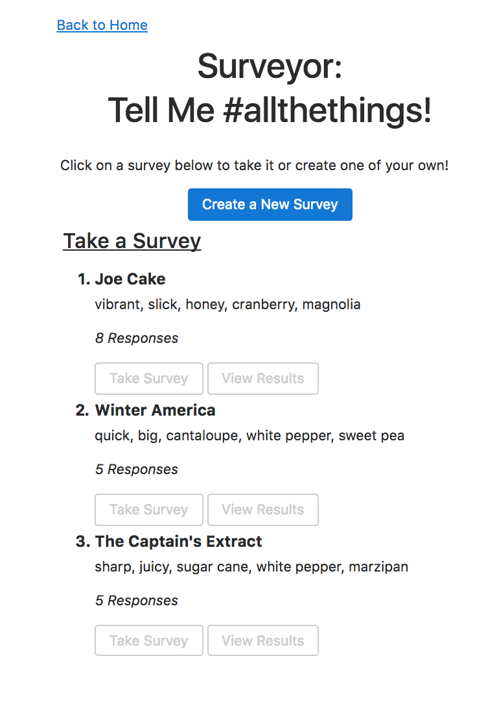
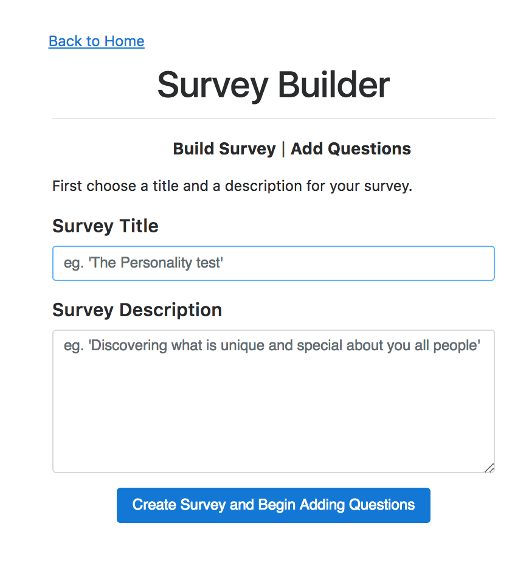
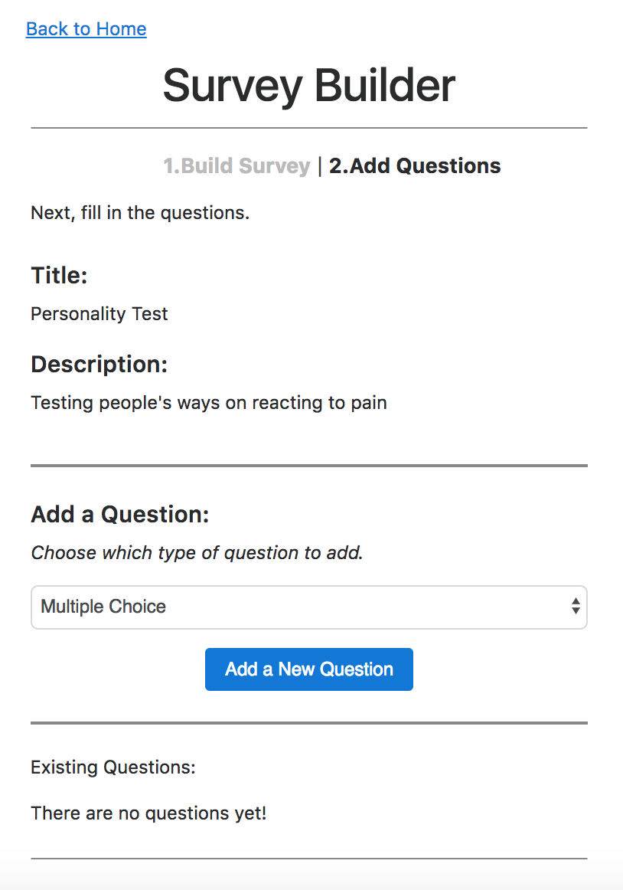
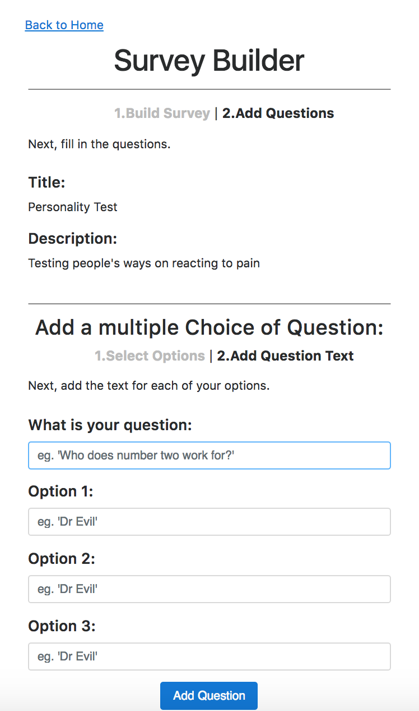
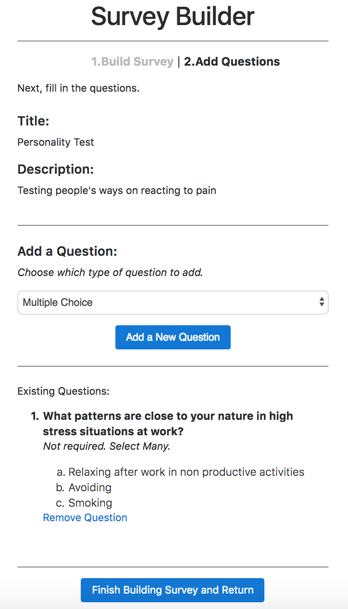
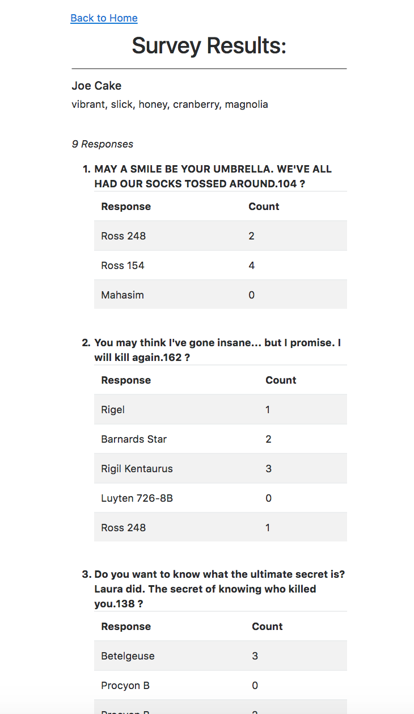

# Project Surveyor - Online Survey Creator (beta)
========================

The Surveyor application  allows the user to rapidly create survey so he can pass it onto his customers, allow those customers to take those surveys, and finally allow the user to analyze the survey data.

This project was run in a SCRUM-based Agile Development workflow via Pivotal Tracker. It included creating front end in HTML and CSS, and the back end - data model as the infrastructure for creating different kinds of surveys, Views, Controller... This version is limited only to single and multiple choice questions.

This beta version awaiting upgrade - creating value range questions, making questions obligatory...

## About the author
[Dariusz Biskupski](http://dariuszbiskupski.com/)

## Getting Started

Live version of the app available on Heroku -> here:
live version on: [Project Surveyor LIVE DEMO](https://shrouded-wildwood-51476.herokuapp.com/)

Survey Creation
Survey Taking
Survey Results Viewing

### Overview

**  The main screen. Here we can view the results, take a survey or create a new survey  **

**   After clicking create survey on the main screen, we are brought to this screen to create survey name and add description  **

**   Here user can decide whether to add single or multiple type of questions **

**   After clicking: add new multiple choice question and deciding about 3 options we see the following screen - here the user can built question and potential answers  **

**   Here we see first question added in the form that appearing during creation process **

**   Checking results of the survey taken by some customers (questions and answers is seeded here with very random data )   **

live version on: [Project Surveyor LIVE DEMO](https://shrouded-wildwood-51476.herokuapp.com/)

### Installing

To get the app started locally you'll need to:

1. Clone the repo with `git clone REPO_URL`
2. `cd` into the project
3. Run
  - `$ bundle install`
  - `$ bundle exec rake db:migrate`
  - `$ bundle exec rake db:seed`
(# take a look around the schema file to see how models were created)

4. Start up the server with `rails s` command and visit `http://localhost:3000` in your browser

## Acknowledgments

* I would like to thank to The Viking Code School for big help in advancing with this application, as well as to my mentor Holman Gao who helped me with stumbling challenges on the way. Last, but not the least - big thank you to [https://stackoverflow.com](https://enigmatic-earth-17108.herokuapp.com).
